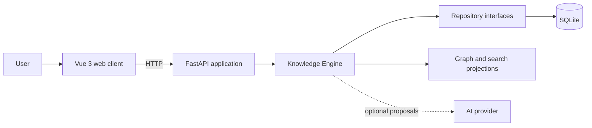

<div align="center">

# Shard Archive

### Turn scattered lore into an explorable narrative world.

An open-source, local-first narrative knowledge engine for writers, worldbuilders, narrative designers, and lore researchers.

[](https://github.com/arconteus/shard-archive/actions/workflows/ci.yml)
[](LICENSE)
[](#project-status)

[Vision](docs/vision.md) · [Documentation](docs/README.md) · [Roadmap](docs/roadmap.md) · [Get started](#getting-started)

</div>

---

Narrative knowledge rarely fits neatly into pages and folders. Shard Archive preserves prose, sources, assertions, ambiguity, and conflicting perspectives while making them searchable and explorable—without taking the archive out of the user's control.

## Why Shard Archive?

| Principle | What it means |
| --- | --- |
| **Local first** | Core workflows and canonical knowledge do not depend on a cloud service. |
| **Narrative first** | Preserve authorial prose separately from assertions derived from it. |
| **Source aware** | Record provenance without treating a source as truth. |
| **Graph enabled** | Explore a useful, partial projection of structured claims. |
| **AI assisted** | Optional AI may suggest and organize; the user remains the authority. |

## What Shard Archive Is Designed to Do

- Capture incomplete prose without forcing upfront structure.
- Manage identities, sources, fragments, and independently assessable claims.
- Preserve evidence, temporal context, ambiguity, and conflicting accounts.
- Explore structured claims through an interactive knowledge graph.
- Search by text and, eventually, semantic meaning.
- Use optional AI to suggest entities, claims, structure, and summaries.
- Import and export knowledge in portable formats.

> [!IMPORTANT]
> These are product goals, not completed features. See the [project status](#project-status) and [roadmap](docs/roadmap.md).

## Project Status

Shard Archive is in **early development**. The repository currently provides a FastAPI backend and Vue 3 client foundation, automated quality checks, canonical documentation, and Codekeeper development workflows.

The first product milestone establishes local projects and the canonical core: Entity, Source, Fragment, and Claim. Graph visualization operates on derived structured claims.

## Architecture



The Knowledge Engine manages canonical narrative knowledge and projects it into rebuildable graph and search views. Persistence and AI remain replaceable infrastructure and do not define the domain. See the [architecture overview](docs/architecture/overview.md) and [domain model](docs/README.md#domain-model).

## Technology

| Area | Stack |
| --- | --- |
| Web client | Vue 3, TypeScript, Vite |
| Local API | Python 3.12+, FastAPI |
| Tooling | Node.js, npm, uv, Codekeeper |
| Quality | Pytest, Ruff, ESLint, Prettier, vue-tsc |
| Planned persistence | SQLite |
| Optional AI | Provider adapters; Ollama is one possible provider |

## Getting Started

Install [Node.js](https://nodejs.org/), [uv](https://docs.astral.sh/uv/), and Git, then run:

```shell
git clone https://github.com/arconteus/shard-archive.git
cd shard-archive
npm run codekeeper -- setup
npm run codekeeper -- dev
```

The web client runs at <http://localhost:5173> and the API at <http://localhost:8000>. See the [Codekeeper guide](docs/tools/codekeeper.md).

## Development Commands

```shell
npm run codekeeper -- setup
npm run codekeeper -- dev
npm run codekeeper -- check
npm run codekeeper -- format
npm run codekeeper -- help
```

## Repository Structure

```text
shard-archive/
|-- apps/           # FastAPI API and Vue web client
|-- docs/           # Product, architecture, and domain documentation
|-- scripts/        # Codekeeper and repository workflows
`-- package.json    # Repository-level command entry point
```

## Documentation

Start with the [documentation index](docs/README.md), [vision](docs/vision.md), [product philosophy](docs/philosophy.md), [architecture](docs/architecture/overview.md), and [glossary](docs/glossary.md). The v0.1 architecture is provisionally stable for implementation and may evolve when implementation provides new evidence.

## Contributing

Keep changes focused, record major architectural decisions with an ADR, and run `npm run codekeeper -- check` before opening a pull request.

## License

Shard Archive is free software licensed under the [GNU Affero General Public License v3.0](LICENSE).
