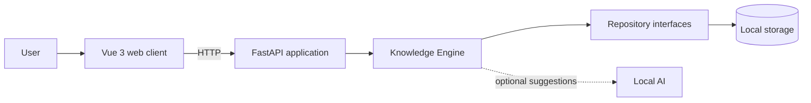

<div align="center">

# Shard Archive

### Turn scattered lore into an explorable narrative world.

An open-source, local-first knowledge graph for writers, worldbuilders,
narrative designers, and lore researchers.

[](https://github.com/arconteus/shard-archive/actions/workflows/ci.yml)
[](LICENSE)
[](#project-status)

[Vision](docs/vision.md) · [Documentation](docs/README.md) · [Roadmap](docs/roadmap.md) · [Get started](#getting-started)

</div>

---

Narrative knowledge rarely fits neatly into pages and folders. A character can
be tied to places, factions, artifacts, conflicting accounts, and events that
span an entire world.

**Shard Archive** is being built to capture those scattered fragments and turn
them into a connected, searchable knowledge graph—while keeping the archive on
the user's machine and under their control.

## Why Shard Archive?

| Principle | What it means |
| --- | --- |
| **Local first** | Core workflows and user data do not depend on a cloud service. |
| **Fragment friendly** | Capture notes, rumors, quotes, and observations before deciding where they belong. |
| **Source aware** | Preserve provenance, confidence, interpretations, and conflicting accounts. |
| **Graph native** | Model narrative knowledge through explicit entities and relationships. |
| **AI assisted** | AI may suggest and organize; the user remains the authority. |
| **Progressively powerful** | Start with simple records and adopt graph, semantic, and AI features as needed. |

## What Shard Archive Is Designed to Do

- Capture incomplete narrative fragments without forcing an upfront structure.
- Connect characters, locations, objects, factions, events, and sources.
- Explore distant relationships through an interactive knowledge graph.
- Track provenance and distinguish facts, rumors, hypotheses, and interpretations.
- Search an archive by text and, eventually, semantic meaning.
- Use optional local AI to suggest classifications and possible connections.
- Import and export knowledge in portable formats.

> [!IMPORTANT]
> These are the product goals, not a list of completed features. See the
> [project status](#project-status) and [roadmap](docs/roadmap.md) for the current
> implementation stage.

## Project Status

Shard Archive is in **early development**. The repository currently provides the
application foundation:

- a FastAPI backend with a health endpoint;
- a Vue 3 and TypeScript web client;
- automated tests, linting, formatting, type checking, and CI;
- product, domain, and architecture documentation;
- Codekeeper, the repository's development console.

The first product milestone is the v0.1 MVP: local projects, fragments,
entities, typed relationships, sources, graph visualization, search, portable
data, and SQLite persistence. Progress is tracked in the
[roadmap](docs/roadmap.md).

## Architecture

Shard Archive uses a local web application with clear boundaries around its
domain and infrastructure:



The **Knowledge Engine** owns graph consistency, provenance, and entity and
relationship resolution. Persistence and AI remain replaceable infrastructure;
neither is allowed to define the domain. Read the
[architecture overview](docs/architecture/overview.md) for the complete design.

## Technology

| Area | Stack |
| --- | --- |
| Web client | Vue 3, TypeScript, Vite |
| Local API | Python 3.12+, FastAPI |
| Tooling | Node.js, npm, uv, Codekeeper |
| Quality | Pytest, Ruff, ESLint, Prettier, vue-tsc |
| Planned persistence | SQLite |
| Planned local AI | Ollama |

## Getting Started

### Prerequisites

- [Node.js](https://nodejs.org/) with npm
- [uv](https://docs.astral.sh/uv/)
- [Git](https://git-scm.com/) when working from a clone

Clone the repository and open its directory:

```shell
git clone https://github.com/arconteus/shard-archive.git
cd shard-archive
```

Launch the interactive development console:

```shell
npm run codekeeper
```

On its first run, Codekeeper prepares its terminal dependency automatically.
From the menu you can install project dependencies, start both applications,
run validation, or apply formatting.

For a non-interactive setup and development session:

```shell
npm run codekeeper -- setup
npm run codekeeper -- dev
```

Once running, the local services are available at:

| Service | URL |
| --- | --- |
| Web client | <http://localhost:5173> |
| API | <http://localhost:8000> |
| Health check | <http://localhost:8000/health> |

Use `Ctrl+C` in the Codekeeper session to stop both applications. See the
[Codekeeper guide](docs/tools/codekeeper.md) for all commands and troubleshooting.

## Development Commands

All shared workflows run through Codekeeper from the repository root:

```shell
npm run codekeeper -- setup   # Install backend and frontend dependencies
npm run codekeeper -- dev     # Start the API and web client
npm run codekeeper -- check   # Run tests and quality checks
npm run codekeeper -- format  # Apply repository formatting
npm run codekeeper -- help    # Show command help
```

## Repository Structure

```text
shard-archive/
|-- apps/
|   |-- api/       # FastAPI application
|   `-- web/       # Vue 3 application
|-- docs/          # Product, architecture, and domain documentation
|-- scripts/       # Codekeeper and repository workflows
`-- package.json   # Repository-level command entry point
```

## Documentation

The [documentation index](docs/README.md) is the best place to explore the
project in depth:

- [Vision](docs/vision.md) and [product philosophy](docs/philosophy.md)
- [Product requirements](docs/product-requirements.md) and [roadmap](docs/roadmap.md)
- [Architecture](docs/architecture/overview.md) and
  [Architecture Decision Records](docs/README.md#architecture-decision-records)
- [Domain model](docs/README.md#domain-model)
- [Glossary](docs/glossary.md)

Documentation describes the intended direction and may evolve as implementation
and research provide new evidence.

## Contributing

Contributions are welcome while the project takes shape. Keep changes focused,
follow the documented local-first architecture, and record major architectural
decisions with an ADR. Before opening a pull request, run:

```shell
npm run codekeeper -- check
```

## License

Shard Archive is free software licensed under the
[GNU Affero General Public License v3.0](LICENSE).
