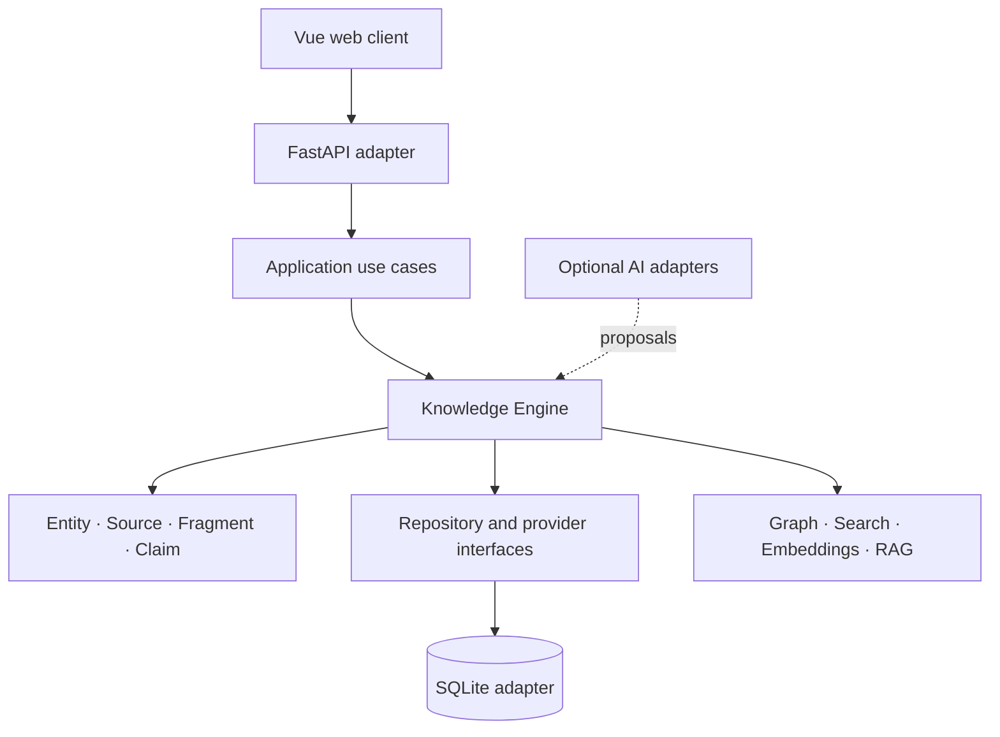
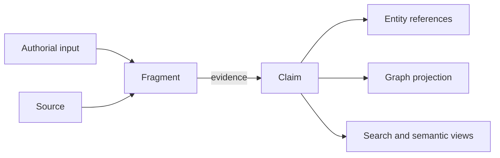

# Architecture Overview

## Purpose

Shard Archive is a local-first narrative knowledge engine. The v0.1 architecture is provisionally stable for implementation and separates canonical knowledge from derived representations and infrastructure.

## High-Level Architecture

## Canonical Domain

Entity represents identity, Source represents provenance, Fragment represents authorial prose and context, and Claim represents an independently manageable assertion. No graph edge, index, model output, or infrastructure object is canonical knowledge.

World, Project, Taxonomy, Constructor, and Sandbox remain useful organizational, application, or UX concepts rather than additional canonical primitives.

## Layers and Dependency Direction

- UI and API adapters translate user and HTTP interactions.
- Application services coordinate use cases such as create Fragment, accept Claim, attach evidence, merge Entity, search, and explore.
- The Knowledge Engine enforces domain rules, provenance, authority boundaries, and projection policies.
- Repository and provider interfaces belong to inner layers; SQLite, files, search engines, and AI providers implement those interfaces.

Source-code dependencies point inward. Domain and application code must not depend directly on FastAPI, SQLite, Ollama, a vector database, or another concrete provider.

## Knowledge Flow

Fragments have stable identity and mutable content. AI may suggest segmentation during imports, but normal authoring does not require AI segmentation before a Fragment exists.

## Derived Systems

Graph projections, full-text indexes, embeddings, vector indexes, similarity scores, semantic clusters, summaries, and RAG context are partial or computed views. They may be destroyed and rebuilt without loss of canonical knowledge.

SQLite remains planned canonical persistence, but repository abstractions prevent SQLite-specific behavior from defining the domain. Neo4j, microservices, event sourcing, and cloud infrastructure are not part of v0.1.

## AI and UX Boundaries

AI providers may extract entities, suggest Claims or structure, summarize, retrieve, and embed. AI proposes; the Knowledge Engine validates; the user retains authority.

Constructor workflows perform intentional mutations. Sandbox workflows search, traverse, compare, simulate, or infer without implicit canonical side effects. Promotion from Sandbox requires an explicit Constructor approval flow.
